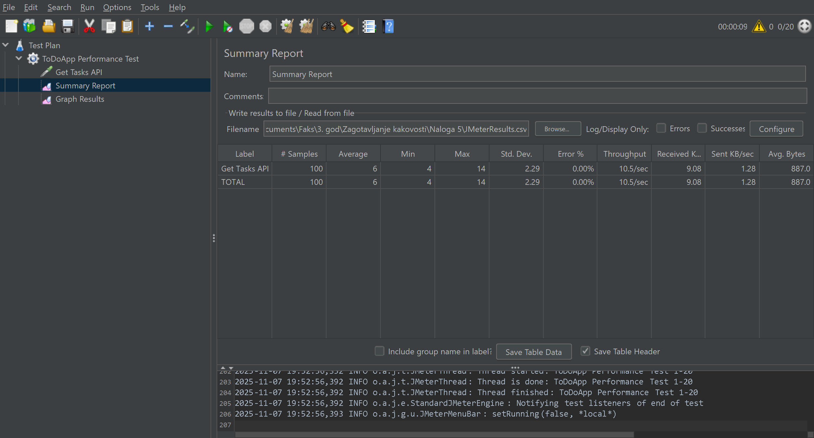
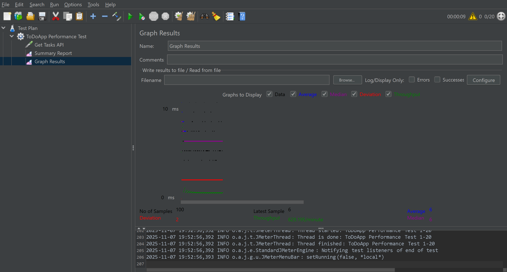

## Sistemski test – Performance test

**Naloga:** 5 – Sistemski testi (nefunkcionalni zahtevi)  
**Datum izvedbe:** 7. november 2025  
**Uporabljeno orodje:** Apache JMeter

---

### 1. Namen testa

Cilj sistemskega testa je preveriti **odzivnost in zmogljivost** aplikacije *To-Do App* pri večjem številu hkratnih uporabnikov.  
Test je bil osredotočen na API zahtevek **GET /api/tasks/all**, ki vrača seznam vseh opravil (tasks) iz baze.

---

### 2. Postopek izvedbe testa

Test je bil izveden z orodjem **Apache JMeter** na lokalnem okolju (*Spring Boot backend, React frontend, MySQL baza*).

V testnem načrtu so bile uporabljene naslednje komponente:

### Thread Group
- Število uporabnikov (threads): **20**
- Ramp-up čas: **10 s**
- Število ponovitev (loop count): **5**

### HTTP Request
- Metoda: **GET**
- URL: `http://localhost:8080/api/tasks/all`
- Namen: preverjanje hitrosti pridobivanja vseh opravil iz baze

###  Listenerji
- **Summary Report** (za statistične rezultate)
- **Graph Results** (za vizualni prikaz zmogljivosti sistema)

---

## 3. Rezultati testa

| Metrika | Vrednost |
|----------|-----------|
| Skupno število zahtevkov | 100 |
| Povprečni odzivni čas | **6 ms** |
| Najmanjši / Največji odzivni čas | **4 ms / 14 ms** |
| Standardni odklon | **2.29** |
| Delež napak | **0 %** |
| Prepustnost (Throughput) | **10.5 zahtevkov/sekundo** |
| Povprečna velikost odziva | **887 bajtov** |

---

### 4. Grafični prikaz rezultatov testa

Na spodnjem grafu so prikazani rezultati **performance testa** za API `/api/tasks/all`.  
Uporabljene nastavitve:
- 20 uporabnikov
- ramp-up 10 s
- 5 ponovitev

Na grafu so prikazane naslednje metrike:
- **Average (povprečje):** 6 ms
- **Median:** 6 ms
- **Deviation:** 2 ms
- **Throughput:** 629 zahtevkov/minuto

###  Slike rezultatov
  

---

### 5. Zaključek

Rezultati testa kažejo, da aplikacija *To-Do App* deluje **odzivno, stabilno in brez napak** tudi pri 20 hkratnih uporabnikih.  
Odzivni časi so zelo kratki (v povprečju 6 ms), kar kaže na dobro optimiziran API in ustrezno delovanje baze.
