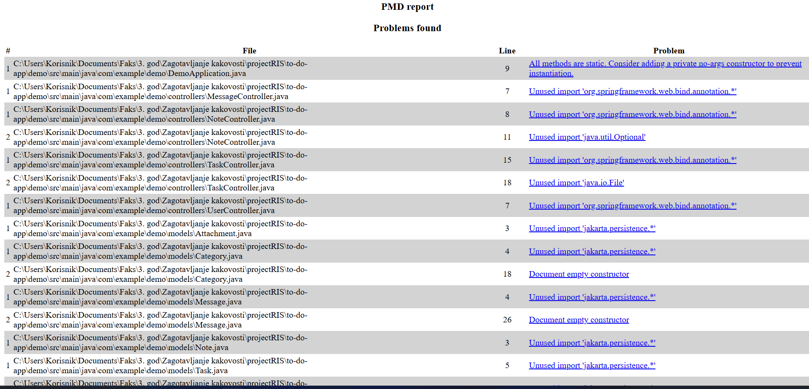
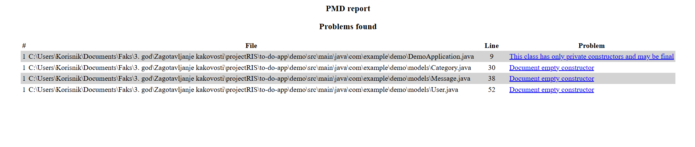

## Naloga 9

### 1. Uvod

Namen naloge je bila analiza kakovosti programske rešitve s pomočjo orodja **PMD** ter izvedba refaktoringa na podlagi zaznanih pomanjkljivosti v kodi.  

---

### 2. Uporabljeno orodje 

Za statično analizo izvorne kode smo uporabili orodje **PMD 7.19.0**.  
Analiza je bila izvedena z uporabo **kataloga pravil PMD**, natančneje nabora **Java Quickstart**, ki vsebuje osnovna pravila za zaznavanje pogostih napak, slabih praks in oblikovnih pomanjkljivosti v programskem jeziku Java.

Katalog pravil je služil kot vodilo pri:
- prepoznavanju pomanjkljivosti v kodi,
- izbiri ustreznih refaktoring posegov,
- objektivni presoji izboljšanja kakovosti rešitve.

Refaktoring tako je bil izveden na podlagi obstoječega in dokumentiranega kataloga pravil.

---

### 3. Prva analiza kode (PMD – BEFORE)

V prvi fazi smo izvedli začetno PMD analizo obstoječe programske rešitve.  
Rezultati analize so pokazali večje število opozoril, med katerimi so izstopala predvsem:

- neustrezni import,
- neustrezna uporaba loggerjev,
- nedokumentirani prazni konstruktorji,
- oblikovne pomanjkljivosti posameznih razredov.

Posebej je izstopal razred **`ReminderService`**, ki je vseboval več PMD opozoril v primerjavi z drugimi razredi.

---

### 4. Identifikacija God Class

Na podlagi prve PMD analize smo razred **`ReminderService`** identificirali kot kandidata za **God Class**.

Razred združuje več različnih odgovornosti, kot so:
- dostop do podatkovne baze,
- poslovna logika za preverjanje rokov nalog,
- pošiljanje elektronske pošte,
- ustvarjanje uporabniških sporočil,
- časovna logika in logiranje.

Takšna zasnova krši načelo **Single Responsibility Principle (SRP)** in otežuje vzdrževanje ter nadaljnji razvoj programske rešitve.

---

### 5. Izvedeni refaktoring

Na podlagi rezultatov PMD analize smo izbrali in izvedli naslednjih **pet refaktoring posegov**:

1. **Refaktoring razreda `ReminderService` (God Class)**  
   – odpravljene so bile zaznane pomanjkljivosti in izboljšana struktura kode.

2. **Uvedba log-level guardov pri uporabi loggerjev**  
   – v razredih `ReminderService` in `EmailService` so bili logger klici zaščiteni z uporabo `isInfoEnabled()`.

3. **Dodajanje privatnega konstruktorja v razred `DemoApplication`**  
   – preprečeno je bilo nepotrebno instanciranje razreda, ki vsebuje izključno statične metode.

4. **Odstranitev neustreznih import**  
   – zamenjani so bili splošni uvozi (`*`) z eksplicitnimi uvozi v kontrolerjih in modelih.

5. **Dokumentiranje praznih konstruktorjev v JPA modelih**  
   – dodani so bili JavaDoc komentarji za prazne konstruktorje v razredih `User`, `Message`, `Category`, `Task`.

---

### 6. Druga analiza kode

Po izvedenem refaktoringu smo ponovno zagnali PMD analizo nad posodobljeno kodo.  
Rezultati so pokazali **bistveno zmanjšanje števila zaznanih opozoril** v primerjavi s prvo analizo.

Preostala opozorila so informativne narave (npr. priporočilo za označitev razreda kot `final`) in ne vplivajo na funkcionalnost ali kakovost programske rešitve.

---

### 7. Zaključek

Na podlagi izvedene analize in refaktoringa lahko zaključimo, da se je kakovost programske rešitve izboljšala.  
Uporaba orodja PMD in kataloga pravil je omogočila sistematično prepoznavanje problematičnih delov kode ter izbiro ustreznih refaktoring posegov.  
Ponovna analiza je potrdila, da je refaktoring prispeval k boljši berljivosti, vzdrževanju in splošni kakovosti rešitve.
